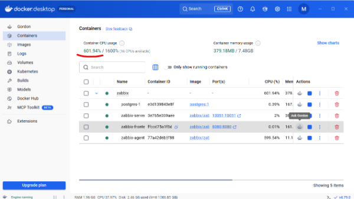

# Monitoramento de Rede com Zabbix e Docker

## Introdução

Este repositório documenta uma demonstração prática de monitoramento de infraestrutura utilizando o **Zabbix**, executado em containers **Docker**. O objetivo foi apresentar aos colegas, de forma didática, como funcionam as práticas modernas de gerenciamento de rede, cobrindo desde a coleta de métricas até a geração de alertas em tempo real.

A demonstração simula um estudo de caso realista: uma aplicação que passa a apresentar comportamento anormal, consumindo recursos excessivos do servidor, e como uma stack de monitoramento identifica e reporta esse problema.

---

## Escopo

- Configuração de um ambiente completo de monitoramento utilizando Docker, sem necessidade de instalação local das aplicações.
- Orquestração dos seguintes componentes via `docker-compose`:

  - **Zabbix Server** — responsável pelo processamento dos dados coletados.
  - **Zabbix Frontend** — interface web para visualização de dashboards, hosts, triggers e alertas.
  - **Zabbix Agent** — responsável pela coleta de métricas do host monitorado.
  - **PostgreSQL** — banco de dados utilizado para armazenamento das informações do Zabbix.

- Criação de um **trigger customizado**, uma regra automática que dispara um alerta quando o uso de CPU ultrapassa 5% por mais de 1 minuto.
- Teste ao vivo do trigger, forçando consumo artificial de CPU via container e observando o ciclo completo do alerta: geração, exibição no dashboard e resolução.

---

## Fluxo de funcionamento

1. O agente coleta os dados de CPU do host monitorado.
2. O servidor de monitoramento recebe as métricas enviadas pelo agente.
3. A trigger avalia os valores recebidos em tempo real.
4. Quando o limite configurado é ultrapassado, a condição da trigger é atendida.
5. Um alerta é gerado pelo Zabbix.
6. O dashboard exibe o problema, com severidade e detalhes do evento.
7. A equipe de TI inicia a investigação a partir das informações disponibilizadas.

---

## Ambiente utilizado

Toda a stack foi executada via **Docker Desktop**, com os containers orquestrados por `docker-compose`, permitindo subir e derrubar o ambiente completo com poucos comandos, sem dependências instaladas manualmente na máquina host.

---

## Objetivo

Demonstrar, de forma didática, o funcionamento do Zabbix como ferramenta de monitoramento de infraestrutura, evidenciando práticas modernas de gerenciamento de rede e o uso do Docker como forma de simplificar a implantação de ambientes de observabilidade.

---

## Demonstração

**Containers do Zabbix e CPU estressada, simulando o estudo de caso:**

<!-- Adicionar as próximas imagens aqui, seguindo o mesmo padrão:

**Legenda curta explicando a imagem:**

-->
